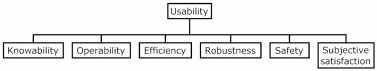

# III. d. Utilisabilité 

Maintenant que nous avons posé des définitions sur les notions d'efficacité, d'efficience et de satisfaction, il nous est possible de définir l'idée d'utilisabilité, sujet d'étude de la cognitique et de l'ergonomie. 

Selon la norme ISO 9241, l'utilisabilité est décrite comme suit:

> Degré selon lequel un produit peut être utilisé, par des utilisateurs identifiés pour atteindre des buts définis avec efficacité efficience et satisfaction, dans un contexte d'utilisation précis. 

De fait, il est possible de considérer qu'une interface est utilisable lorsque le manipulateur peut réaliser la tâche, de façon efficace, qu'il consomme un minimum de ressources pour le faire (c'est à dire avec efficience) et que le système est agréable à utiliser et donne satisfaction[^1].

La cognitique vise à étudier l'utilisabilité d'une interface informatique afin de maximiser les résultats obtenus par l'utilisateur d'un point de vu qualitatif et quantitatif. Néanmoins, considérer les différentes caractéristiques sur lesquelles repose l'utilisabilité de manière indépendante ne présente pas grandement d'intérêt étant donné la forte interdépendance des celles-ci. 

Aussi Alonso-Rios (2009) propose une taxonomie des différents attributs du concept d'utilisabilité d'un système à considérer de manière globale:

* Connaissance (qui rejoint l'idée d'espace d'interaction présentée plus tôt)
* Opérabilité
* Efficience
* Robustesse (Tolérance aux erreurs, stabilité de l'interface)
* Sécurité 
* Satisfaction subjective

Cette taxonomie, excessivement complète rend bien compte de la complexité de la notion d'utilisabilité, qui se trouve être beaucoup plus importante que celle présentée par la norme ISO. 

-----

[^1]: https://tel.archives-ouvertes.fr/tel-00984868/document "Source: Thèse de Véronique Lespinet-Najib"